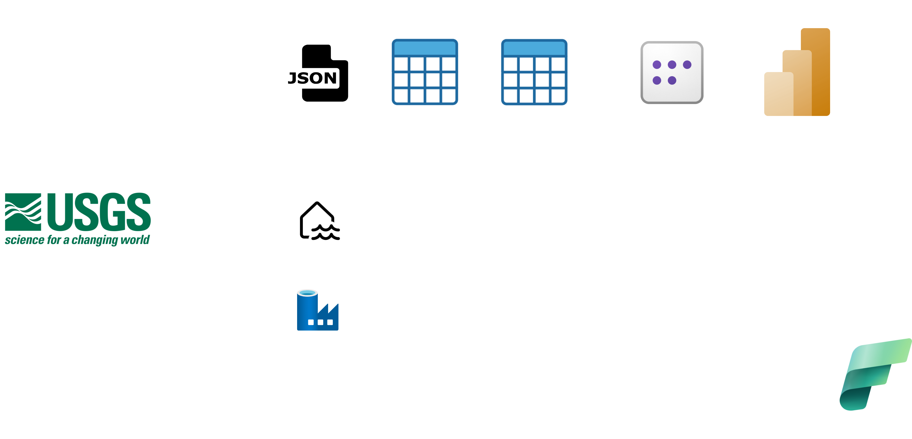
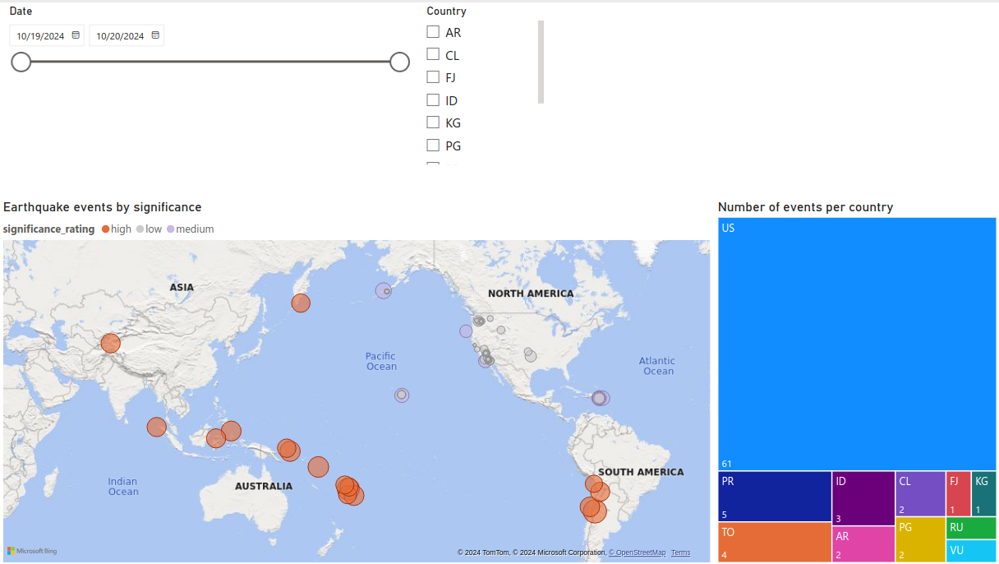

# Earthquake API pipeline with Fabric

## Project Overview
This project automates the process of collecting and analyzing the latest **earthquake events** using [Earthquake API](https://earthquake.usgs.gov/fdsnws/event/1/) and Microsoft Fabric. The goal is to gather fresh information daily, clean the data, and display the results in a Power BI dashboard. 

The pipeline is built using Microsoft Fabric components, including Data Factory, Lakehouse, Jupyter Notebooks, and Power BI, ensuring smooth orchestration, processing, and visualization.

The project uses USGS' [Earthquake API](https://earthquake.usgs.gov/fdsnws/event/1/) as the data source.

## Technologies Used

This project leverages the following Microsoft Fabric components:

- **Storage**
  - Azure Lakehouse (both raw files and tables)
- **Processing and orchestration**
  - Jupyter Notebooks (PySpark)
- **Orchestration**
  - Data Factory
- **Visualization**
  - PowerBI

## Architecture

### Data Factory Pipeline

The pipeline follows the **medallion architecture** with the following tasks:
1. **Bronze**: Retrieve earthquake data from the API and store it in the lakehouse as *.json*.
2. **Silver**: Select relevant columns and transform the *.json* data into a structured table.
3. **Gold**: Apply transformations to enhance data quality:
   - `status`: Filter for "reviewed" earthquakes.
   - `place`: Expand abbreviations (N, S, E, W, NE, etc.) to full direction names (north, south, etc.).
   - `warsaw_time`: Convert `time` to Warsaw time.
   - `country_code`: Add a new column for country acronyms (e.g., US, CH) based on `latitude` and `longitude`.
   - `significance_rating`: Add a new column for earthquake significance rating.

### Power BI Report

## Setup

1. Set up Microsoft Fabric (60 days free trial)
2. Create a new Space called *earthquake*.

#### **Lakehouse**
1. Navigate to Data Engineering.
2. Create a new Lakehouse named `earthquake_lakehouse`.

#### **Notebooks**
1. Go to Data Science
2. Create Three new notebooks (copy mine from `./notebooks` subdir)

#### **Pipeline**

1. Go to Data Engineering & create new Data Pipeline.
2. Then, create the following tasks in the pipeline.
3. Create three *notebook* tasks & connect them to your relevant notebooks
4. Under each task add the following variables:
   - `current_date`: @formatDateTime(pipeline().TriggerTime, 'dd-M-yyyy')
   - `yesterday_date`: @formatDateTime(adddays(pipeline().TriggerTime, -1), 'dd-M-yyyy')
5. Under Gold task, add this additional variable:
   - `mode`: append

#### **Semantic**
Move to this step after you ran the above pipeline at least once.

**Set the default semantic model**
1. Go to your `earthquake_lakehouse`
2. In top right, switch to `SQL Analytics Endpoint`
   
3. Go to `Reporting` -> `Manage default semantic model`
   
4. Choose the relevant table and click `confirm`
   

You can now modify your default model by:
- changing data type
- adding DAX variables
- etc.

We'll leave it as is.
    

#### **Power BI**
1. Create a Power BI report based on the default semantic model.
2. Add the visuals that best represent your data insights.

**Note**: To use the map visual, you will need to enable it in settings. Microsoft shares your latitude and longitude data with third parties to display the map visual.

## Usage

1. **Run the ETL Pipeline**: Trigger the pipeline to begin the data migration and transformation process.
2. **Schedule the Pipeline**: Set up daily execution at 6 AM to get updated earthquake data every morning.
3. **Monitor Pipeline Runs**: Use Microsoft Fabric's monitoring feature to track the status of your pipeline executions.

## Contact
For any questions or inquiries, please contact me at bernasiakk@gmail.com

Thanks for reading!